# lfsinsights

An R package for processing and estimating Labour Force Survey (LFS) microdata. 

The lfs_table() function supports weighted counts, ratios, moving averages, period-over-period change, bootstrap variance, and more. Can run across one or multiple estimates in a single pass. Can read in supplemental files such as TABS+, LMI, DLMI, etc.

Additional functions such as lfs_microdata() outputs microdata records as specified, while lfs_plotly_line() and lfs_plotly_bar() will output standardized charts.

## Installation

```r
# Install the 'remotes' package if needed
install.packages("remotes")

# Install lfsinsights
remotes::install_git("https://gitlab.k8s.cloud.statcan.ca/clmi-cimt/clmi-insights/lfsinsights")

# Load the package
library(lfsinsights)
```


## Get started with the LFS Table Configurator

Configure your table visually and copy the generated R code into your script — no syntax required.

🚀 **[Launch Configurator](https://clmi-cimt.pages.cloud.statcan.ca/clmi-insights/lfsinsights/index.html)**


## Basic usage for a summary table

```r
# Employment count by province and gender (by default uses FINALWT)
df_result <- lfs_table(
  # Date configuration
  start_date    = "2025-01-01",
  end_date      = "2025-04-01",
  
  # Analysis parameters  
  filter_condition = "AGE>=15 & LFSSTAT %in% c(1,2)",
  analysis_vars = "PROV, GENDER"
)
```


## Package Workflow

```mermaid
graph TD
    Start([LFS Insights Process Start<br>lfs_table / lfs_microdata]) --> Setup[Initialization & Setup]
    Setup --> |Validate dates, determine months, load DVs| Loop
    
    subgraph Iterative Monthly Processing
        Loop{For Each Required Month} --> LoadRaw[Load Raw TABS Data]
        LoadRaw --> Supplements[Optional: load other data like NORTH, SUPPLEMENTS, etc]
        Supplements --> DVs[Load derived variables]
        DVs --> ApplyFilter[Apply global filter conditions]
        ApplyFilter --> Boot[Optional: Load BOOTSTRAPS]
        Boot --> ModeCheck{Microdata Only Mode?}
        ModeCheck -->|Yes| StoreRaw[Store Raw Microdata]
        ModeCheck -->|No| CalcSumm[Calculate Estimate Summaries]
    end
    
    %% Splitting the paths clearly prevents overlaps
    StoreRaw --> FinalizeMicro[Combine All Raw Microdata]
    CalcSumm --> PostProcLoop{FOR EACH DEFINED ESTIMATE:}
    
    subgraph Post-Processing & Finalization
        PostProcLoop --> Combine[Combine monthly summaries]
        Combine --> Complete[Complete Data Combinations<br>fill missing rows]
        Complete --> Marginals[Optional: Calculate Marginal Totals]
        Marginals --> MovingAvg[Optional: Calculate Moving Average]
        MovingAvg --> Suppression[Optional: Add Suppression Flags]
        Suppression --> Rounding[Apply Rounding to Estimate Levels]
        Rounding --> Ratios[IF Ratio/Distribution: Calculate Ratios]
        Ratios --> Change[IF Change: Calculate Period Changes]
        Change --> Differences[IF Difference: Calculate Category Differences]
        Differences --> Variance[IF Bootstraps: Calculate Bootstrap Variance]
        Variance --> CombineAll[Combine All Processed Estimates]
    end
    
    %% Re-merging the paths at the end
    CombineAll --> Labels[Optional: Apply Labels]
    FinalizeMicro --> Labels
    
    Labels --> CleanUp[Final Result Clean-up]
    CleanUp --> FinalOut([Final LFS Data Output])
```




## Other Examples of outputs

### Summary table — multiple estimates with change

```r
# Employment count and unemployment rate by province, with month-over-month change
df_result <- lfs_table(

  # Date configuration
  start_date    = "2025-01-01",
  end_date      = "2025-06-01",
  
  # Analysis parameters  
  analysis_vars = "PROV, GENDER",
  filter_condition = "AGE >= 15 & !is.na(LFSSTAT)",
  
  # Estimates configuration
  estimates = list(
    list(
      est_name   = "Employment",
      est_type   = "sum",
      est_filter = "EMPLOYED == 1"
    ),
    list(
      est_name          = "Unemployment rate",
      est_type          = "ratio",
      ratio_numerator   = "UNEMPLOYED",
      ratio_denominator = "LABOURFORCE",
      ratio_type        = "percent",
      ratio_decimals    = 1
    )
  ),
  
  # Calculate change
  calculate_change = TRUE,
  lag_period       = 1
)
```

```r
# Calculate year-over-year, three-month moving average change for VISMIN unemployment rates with bootstrap weights and variance
df_result <- lfs_table(
  # Date configuration
  start_date = "2024-04-01",
  end_date = "2025-04-01",
  moving_avg = 3,
  filter_months = "4",
  
  # Analysis parameters    
  filter_condition = "AGE >= 15 & !is.na(LFSSTAT)",
  analysis_vars = "PROV, GENDER, VISMIN",
  weight_var = "IVMWT", # Note: weight specified
  
  # Estimates configuration
  estimates = list(
    list(
      est_type = "ratio",
      ratio_numerator = "UNEMPLOYED",
      ratio_denominator = "LABOURFORCE",
      ratio_type = "percent",
      ratio_decimals = 1
    )
  ),
  
  # Data sources
  bootstraps = TRUE,
  
  # Processing options
  add_custom_dvs = TRUE,
  add_labels = TRUE,
  language = "EN",
  include_marginals = TRUE,
  weight_rounding = 100,
  add_suppression_flag = FALSE,
  calculate_change = TRUE,
  lag_period = 1
)

```

### Microdata

```r
# Load all microdata records for given month (specyfing in-scope filter)
microdata <- lfs_microdata(
  start_date      = "2025-01-01",
  end_date        = "2025-03-01",
  filter_condition = "AGE >= 15 & !is.na(LFSSTAT)"
)
```

### Visualizations

The package includes standardized plotting functions using `plotly`. The examples below are standalone — replace `df_result` with your own output and adjust the `y` column name to match your estimate type (`FINALWT_sum` for weighted counts, `FINALWT_ratio` for rates and percentages).

```r
# Line chart — typical use case for a weighted sum over time
lfs_plotly_line(
  data     = df_result,
  x        = "DATE",
  y        = "FINALWT_sum",
  color    = "GENDER",
  title    = "Employment by Gender",
  subtitle = "Monthly estimates",
  y_title  = "Number of persons"
)

# Bar chart — typical use case for a ratio or rate
lfs_plotly_bar(
  data  = df_result,
  x     = "DATE",
  y     = "FINALWT_ratio",
  color = "PROV",
  title = "Unemployment Rate by Province"
)
```


## Complete parameters

All available parameters for `lfs_table()`, with inline notes on usage.

```r
df_result <- lfs_table(

  # Date range
  start_date  = "2024-04-01",
  end_date    = "2025-04-01",

  # Date filtering
  moving_avg    = 3,      # Periods for moving average (1, 3, or 12 most common)
  filter_months = "4",    # Restrict to specific months, e.g. "4" for April only
  filter_years  = NULL,   # Restrict to specific years, e.g. "2024, 2025"
  prerelease    = FALSE,  # Use pre-release data for the latest month

  # Analysis parameters
  filter_condition = "AGE >= 15 & !is.na(LFSSTAT)",  # Applied at data load
  analysis_vars    = "PROV, GENDER, VISMIN",
  weight_var       = "IVMWT",  # Options: "FINALWT", "IVMWT", "supp_weight"

  # Estimates — one or more, each as a list
  estimates = list(

    # Weighted count
    list(
      est_name   = "Employment",
      est_type   = "sum",
      est_filter = "EMPLOYED == 1"
    ),

    # Ratio / rate
    list(
      est_name          = "Unemployment rate",
      est_type          = "ratio",
      ratio_numerator   = "UNEMPLOYED",
      ratio_denominator = "LABOURFORCE",
      ratio_type        = "percent",   # "percent" or "average"
      ratio_decimals    = 1
    ),

    # Average (e.g. hourly wages)
    list(
      est_name          = "Average hourly wages",
      est_type          = "ratio",
      ratio_numerator   = "HRLYEARN",
      ratio_denominator = "POP",
      ratio_type        = "average",
      ratio_decimals    = 2,
      est_filter        = "LFSSTAT %in% c(1,2) & COWMAIN %in% c(1,2)"
    ),

    # Distribution across all levels of a variable
    list(
      est_name       = "Industry distribution",
      est_type       = "ratio_distribution",
      var_name       = "INDUSTRY",
      ratio_type     = "percent",
      ratio_decimals = 1
    )
  ),

  # Data sources
  bootstraps      = TRUE,   # Include bootstrap weights for variance estimation
  tabs_plus       = FALSE,  # Include TABS Plus variables
  north           = FALSE,  # Include territories (Nunavut, N.W.T., Yukon)
  supplement_lmi  = FALSE, # LMI monthly supplement (from January 2022)
  supplement_lmsi = FALSE, # LMSI quarterly supplement (from July 2022)
  supplement_dlmi = FALSE, # DLMI annual disability supplement (from 2022)

  # Processing options
  add_custom_dvs     = TRUE,   # Apply custom derived variables (custom_dvs.R)
  add_labels         = TRUE,   # Apply value labels
  language           = "EN",   # "EN" or "FR"
  include_marginals  = TRUE,   # Include marginal totals
  weight_rounding    = 100,    # Divide estimate levels by this factor
  add_suppression_flag = FALSE, # Flag estimates below reliability threshold

  # Change over time
  calculate_change = TRUE,
  lag_period       = 1,    # Periods to lag (1 = month-over-month, 12 = year-over-year)

  # Difference between two categories
  calculate_difference   = TRUE,
  comparison_variable    = "GENDER",
  comparison_categories  = c("1", "2")  # Category 1 minus category 2
)
```
